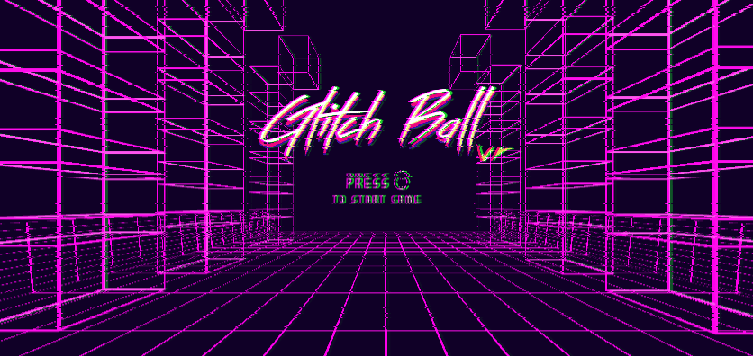
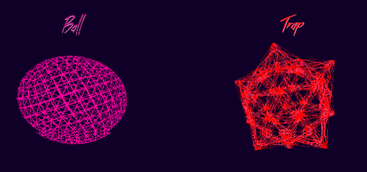

# Glitch Ball VR

Glitch Ball  is a simple VR Game, where you hit incoming projectiles with a tennis racket.
Its visual style is inspired by the 80s with simple polygonal shapes and graphics.

Main Menu:

Game Footage:

How to play:

The game is very easy, just hit the incoming balls and avoid the traps.
The levels get progressivly harder and you have just 3 lifes.
You lose lifes when you fail to hit a incoming ball or hit a trap.
Good Luck!

This project is for personal use only.
